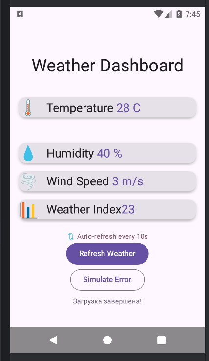
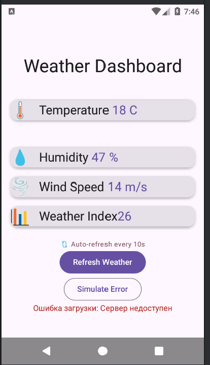

# Лабораторная работа №17-18. Корутины на практике: Метеосводка

Приложение которое автоматически генерирует скорость ветра, температуру влажность и индекс погоды. Имеет автоматическое обновление.


## Функциональность
- Автообновление
- асинхронные вызовы функций
- расчет влажности
- расчет индекса погоды
- расчет температуры
- скорости ветра

## Технологии и библиотеки
- 
- а
## Контрольные вопросы
- launch это запуск чего-то параллельного без ожиания. async это параллельное выполнение и использование данных потом. launch - когда хочешь записать что-то в бд.async когда посчитать сумму больших данных и потом их забрать  
```kotlin
GlobalScope.launch {
    println("//")
}
val result = GlobalScope.async {
    5 + 10
}
println(result.await())
```
- suspend - это функция которая умеет ставиться на паузу без блокировки потока. Для ее вызова нужна корутина.delay не блокирует потом потому что продолжает работать с другими задачами 
```kotlin
suspend fun waitAndPrint() {
    delay(1000)
    println("///")
```
- Диспетчеры решают где будет выполняться корутина, на главном потоке или на фоновых вычислениях. Если на Dispatchers.Main запустить тяжёлую задачу приложение замрёт. кнопки не работают.экран зависнет.
  | Диспетчер | Для чего                          |
  |-----------|-----------------------------------|
  | Main      | Обновлять UI                      |
  | IO        | Читать писать файлы               |
  | Default   | Сложные вычисления                |
- Если не обработать то корутину выкинет с ошибкой. try-catch нужен чтобы поймать ошибку и не дать приложению сломаться.
- viewModelScope это специальная зона для корутин внутри ViewModel.Когда viewModelScope уничтожается все корутины отменяются
- Перед началом работы вам необходимо клонировать проект себе на компьютер. Это можно сделать командой git clone. Дальше запускаете приложение зеленой кнопкой или нажатием shift + f12 
- скриншоты
- 
- 
- Вахрушева Алина ИСП-233 5 марта 